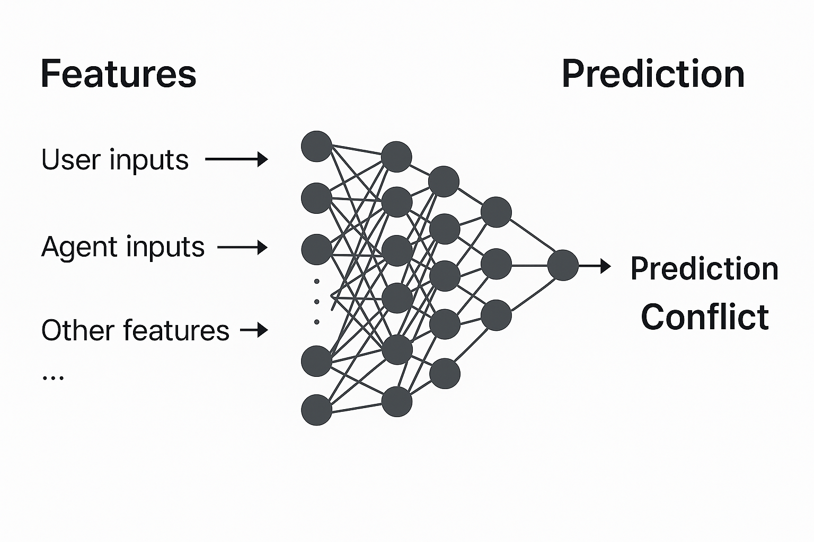

## Architectural Solution for an Explainable Agentic AI Control Layer
## Introduction
The Decision-Making Group is developing two complementary AI frameworks:
1. **An ontology-driven knowledge graph (KG) architecture** combined with multi-agent semantic reasoning for reliable decision-making.  
2. **A dynamic multi-agent system** capable of progressive expert-level upskilling, enabling adaptive execution of complex tasks requiring human-like micro-decisions.

Together, these systems aim to enable enterprise AI assistants that can reason, coordinate, learn, and execute decisions in a structured and interpretable way.

However, enterprise adoption requires more than backend intelligence. Organizations need:
- transparency into automated reasoning,  
- meaningful human oversight, and  
- user-centered control over semantic decision systems.

A major challenge is how to expose complex reasoning, highlight the most relevant explanations, and provide intuitive human control — **without overwhelming users**.

### Thesis Goal
This thesis aims to design and prototype an **XAI-driven control layer** that unifies and exposes the capabilities of semantic reasoning and multi-agent decision systems.

The objective is to provide:
- human-readable explanations,  
- progressive disclosure of reasoning,  
- conflict detection and resolution insights,  
- structured decision traces, and  
- a web interface for supervising or overriding automated decisions.

The prototype integrates:
1. an ontology / knowledge graph,  
2. a multi-agent reasoning architecture,  
3. an explainability data layer, and  
4. a web-based interaction and control interface.

## Goal of the Document
In this Architectural Solution document, I assume a **_hypothetical scenario_** where the goal is to design an **explainable Agentic AI Control Layer** that allows users to understand and interact with autonomous agents making complex decisions. 
This scenario involves the following key objectives:
1. Design a domain ontology that captures the relevant concepts, relationships, and decision-making criteria for the agents.
2. Design a knowledge graph (KG) that represents the ontology and supports semantic reasoning.
3. Design a multi-agent system where agents can autonomously make decisions based on the KG and progressively upskill their expertise.
4. Design an explainability layer that exposes the reasoning processes of the agents, allowing users to inspect decision paths, conflicts, and explanations.
5. Design a web-based interface that enables users to interact with the agents, monitor their actions, and provide feedback or overrides.
6. Conflict Prediction by Machine Learning

## Hypothetical Scenario: Employee Trip Budget Approval
To illustrate how the architectural solution works, a hypothetical scenario is introduced.  
This scenario is **not part of the thesis description** but is used to demonstrate design choices.

### Scenario Description
1. In this scenario, we have an enterprise system where employees can submit trip requests for business travel.  
2. Each trip request includes details such as employee ID, destination, duration, purpose, and estimated cost.
3. Managers approve or deny based on company policies, budgets, and entitlements.  
4. The system should provide clear explanations for why decisions were approved or denied.
### Ontology Design
#### Why Ontology?
1. Provides a structured representation of the domain.  
2. Enables semantic reasoning through classes, relationships, and constraints.  
3. Ensures consistency and interoperability across agents.
#### Ontology Components
1. Core concepts: Employee, TripRequest, Manager, ApprovalDecision, CompanyPolicy, Budget, Entitlement  
2. Relationships such as:
   - Employee submits TripRequest  
   - Manager reviews TripRequest  
   - ApprovalDecision depends on Policy, Budget, and Entitlement  
3. Entity Relationship Diagram (ERD):

   
### Knowledge Graph Implementation (Relational Prototype)
For the prototype, the ontology is implemented as a **lightweight semantic schema** using a relational database.  
In a full thesis implementation, this can evolve into an RDF or graph database (Neo4j, GraphDB).
1. Tables: Employees, TripRequests, Policies, Budgets, Entitlements  
2. Foreign keys represent relationships  
3. Rules and constraints support semantic reasoning  
4. Compatible relational DBs: MySQL, PostgreSQL, Oracle  
   
### Multi-Agent System
### Agent Roles
- **TripRequestAgent** – collects and registers trip requests  
- **ApprovalAgent** – orchestrates evaluation and resolves conflicts  
- **PolicyAgent** – checks policy rules  
- **BudgetAgent** – checks cost vs budget  
- **EntitlementAgent** – checks employee entitlement limits  

Agents:
- access KG data  
- perform domain-specific reasoning  
- log their steps for explainability  
  
**Example Explanation Output:**

    **Trip denied** because the estimated cost (4000 SEK) exceeds the employee entitlement (2500 SEK) and violates company policy rule P3.

This is the type of human-readable explanation that the control layer will display, showing the key factors behind the decision.

## End-to-End Decision Flow (Mini Demo)

1. Employee submits a trip request  
2. TripRequestAgent stores it in the KG  
3. ApprovalAgent requests evaluations from PolicyAgent, BudgetAgent, and EntitlementAgent  
4. Example conflict:
   - PolicyAgent → Approved  
   - BudgetAgent → Rejected  
5. Explainability layer logs reasoning and conflict resolution  
6. Manager reviews explanation and can override  
7. Override is logged for audit and agent upskilling  

## TripRequestAgent (Deep Dive)
In this section, we will explore the architecture and functionality of the TripRequestAgent.

Functions of the TripRequestAgent:
- logs reasoning steps into the Explainability Database  
- interacts with an LLM through tool-calling  
- enables detailed analysis and review of decision traces  

## Explainability Layer
The explainability layer provides:
1. Decision path capture  
2. Conflict detection and resolution  
3. Prioritized, human-readable explanations  
4. Progressive disclosure of reasoning steps  

### Explainability Data Model
Core structures:
- **DecisionTrace** – the reasoning sequence  
- **ConflictRecord** – disagreements + resolutions  
- **Session** – the request container with all explanations and traces  

### Web-Based Interface
#### Sessions Management View

### Workflow of Explainable Agentic AI Control Layer

### Agent Details View

# Furthur Works
## Conflict Prediction by Machine Learning

### Goal
The goal of conflict prediction is to enable a multi-agent decision system to **anticipate agent disagreements before they occur**, based on historical explainability logs, semantic evidence patterns, and contextual features about each session. By predicting conflicts early, the system can proactively request missing data, adjust workflows, and reduce costly escalations.

---

### Introduction
In a semantic multi-agent architecture (e.g., TripRequestAgent, PolicyAgent, BudgetAgent, EntitlementAgent), conflicts arise when agents reach **contradictory conclusions** or when key evidence in the Knowledge Graph (KG) is missing or inconsistent.

#### Examples of conflicts:
- **PolicyAgent says compliant**, but **BudgetAgent says over budget**
- **EntitlementAgent says allowed**, but **PolicyAgent flags a rule violation**
- Agents evaluating the same request using different assumptions

Such conflicts frequently lead to manual review, additional agent calls, or user intervention.  
Machine learning can significantly reduce these disruptions by analyzing explainability logs and learning **patterns that precede conflicts**, enabling predictive detection before the disagreement occurs.

---
### Machine Learning Convolutional Neural Network

### Benefits:
- Finding the root cause of conflicts using ML features
- Improving the Multi-Agent system by conflict prediction 

---

### Finding the Root Cause of Conflicts Using ML Features

Machine learning helps identify **why** conflicts occur by analyzing feature importance and SHAP values.

#### Example root-cause contributions:
- **Cost > department maxCost** → +0.31 to conflict probability  
- **Remaining budget < estimated trip cost** → +0.27  
- **Missing entitlement_level field** → +0.15  
- **High destination risk** → +0.12  
- **Department with historically high conflict rates** → +0.08  

#### Benefits:
- **Automated root-cause analysis**  
  Conflict likely due to remaining budget shortage.

- **Directed evidence requests**  
  Ask BudgetAgent to confirm cost center balance.

- **Better KG consistency checks**  
 Missing cost_center_id is a high-conflict feature. Validate the input.

---

### How Conflict Prediction Improves the Multi-Agent System

#### 1. Preventive Workflow Optimization
If the model predicts a high probability of conflict, the orchestrator can:
- Reorder agents  
- Parallelize or skip certain evaluations  
- Perform validation checks  

This yields faster decisions and lowers system load.

#### 2. Early Detection of Semantic Data Issues
Many conflicts comes from missing or inconsistent KG attributes (e.g., null budget values, outdated entitlements).  
Conflict prediction highlights these risky sessions *before* agents disagree, allowing the system to sanitize data or fetch missing evidence.

#### 3. Reduced Human Overrides
By avoiding predictable conflicts, fewer sessions require human review, improving system autonomy and trust.

---

### Conclusion
By leveraging explainability logs and session metadata, conflict prediction becomes a powerful mechanism for making multi-agent systems more adaptive, efficient, and transparent. It enables proactive decision-making, reduces redundant conflict resolution, and provides actionable insights that improve both data quality and agent behavior.

This transforms conflict handling from a reactive process into an **anticipatory, intelligent capability**—boosting reliability and enterprise readiness of complex agentic systems.

